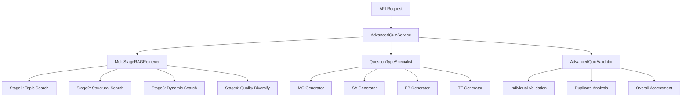

# 🎓 프로덕션 급 PDF RAG 퀴즈 생성 시스템

## 📋 목차
1. [시스템 개요](#시스템-개요)
2. [핵심 유스케이스](#핵심-유스케이스)
3. [전체 아키텍처](#전체-아키텍처)
4. [상세 플로우](#상세-플로우)
5. [품질 보장 메커니즘](#품질-보장-메커니즘)
6. [성능 최적화](#성능-최적화)
7. [API 사용법](#api-사용법)

---

## 🎯 시스템 개요

### 목적
실제 **모의고사/자격증/시험 문제** 수준의 고품질 퀴즈를 PDF 문서 기반으로 자동 생성하는 프로덕션 급 시스템

### 핵심 차별점
- ✅ **정확한 문제 개수 보장** (retry 로직)
- 🧠 **멀티 스테이지 RAG** (심화 컨텍스트 분석)
- 🔍 **의미적 중복 검증** (embedding 기반)
- 🎯 **문제 유형별 전문 생성기**
- 📊 **전문가 수준 품질 검증**
- ⚡ **완전 비동기 처리**

---

## 🎪 핵심 유스케이스

### UC-01: 표준 퀴즈 생성
```
Given: PDF 문서가 업로드됨
When: 사용자가 퀴즈 생성 요청 (문제 수, 난이도, 유형 지정)
Then: 정확한 개수의 고품질 문제가 생성됨
```

### UC-02: 도메인 적응형 퀴즈
```
Given: 다양한 분야의 PDF (알고리즘, AWS, 의학, 법률 등)
When: 동일한 API로 퀴즈 생성 요청
Then: 각 도메인에 특화된 맞춤형 문제가 생성됨
```

### UC-03: 품질 검증 및 피드백
```
Given: 퀴즈가 생성됨
When: 시스템이 품질 검증 수행
Then: 상세한 품질 분석 및 개선 제안 제공
```

### UC-04: 대용량 문서 처리
```
Given: 수백 페이지의 대용량 PDF
When: 퀴즈 생성 요청
Then: 멀티 스테이지 RAG로 효율적 처리
```

---

## 🏗️ 전체 아키텍처



### 주요 컴포넌트

#### 1. **AdvancedQuizService** (메인 오케스트레이터)
- 전체 퀴즈 생성 플로우 관리
- 비동기 병렬 처리 조율
- 에러 핸들링 및 fallback

#### 2. **MultiStageRAGRetriever** (멀티 스테이지 RAG)
- 4단계 컨텍스트 검색
- 의미적 다양성 보장
- 한국어 임베딩 모델 활용

#### 3. **QuestionTypeSpecialist** (문제 유형별 전문가)
- 유형별 특화 프롬프트
- 3회 재시도 보장
- 정확한 개수 생성

#### 4. **AdvancedQuizValidator** (품질 검증 에이전트)
- 개별/전체 품질 평가
- 의미적 중복 검증
- LLM 기반 품질 점수

---

## 🔄 상세 플로우

### Phase 1: 초기화 및 검증
```python
async def generate_guaranteed_quiz(request: QuizRequest):
    # 1. 문서 존재 확인
    doc_info = self.vector_service.get_document_info(request.document_id)
    if not doc_info:
        raise ValueError("문서를 찾을 수 없습니다")
```

### Phase 2: 멀티 스테이지 RAG
```python
    # 2. 4단계 컨텍스트 검색
    contexts = await self.rag_retriever.retrieve_diverse_contexts(
        document_id=request.document_id,
        num_questions=request.num_questions,
        topics=None  # 자동 추출
    )
```

#### Stage 1: 토픽 기반 검색
- **목적**: 특정 주제에 대한 심화 컨텍스트
- **방법**: 토픽별 다양한 검색 쿼리 생성
- **결과**: 주제 특화 컨텍스트 수집

#### Stage 2: 구조적 검색
- **목적**: 문서 전반의 균형잡힌 커버리지
- **방법**: 앞/중간/뒷부분 구조적 검색
- **결과**: 문서 전체 대표성 확보

#### Stage 3: 동적 검색
- **목적**: LLM 기반 지능형 키워드 생성
- **방법**: 문서 분석 후 맞춤 키워드 추출
- **결과**: 도메인 특화 컨텍스트

#### Stage 4: 품질 다양성
- **목적**: 최종 품질 필터링 및 다양성 보장
- **방법**: 의미적 임베딩 기반 다양성 선택
- **결과**: 고품질 다양한 컨텍스트

### Phase 3: 문제 유형별 병렬 생성
```python
    # 3. 문제 유형 분배 계산
    type_distribution = self._calculate_type_distribution(request)

    # 4. 병렬 생성 태스크 생성
    generation_tasks = []
    for question_type, count in type_distribution.items():
        task = self.question_specialist.generate_guaranteed_questions(
            contexts=contexts,
            question_type=question_type,
            count=count,
            difficulty=request.difficulty,
            topic="주요 내용"
        )
        generation_tasks.append(task)

    # 5. 비동기 병렬 실행
    results = await asyncio.gather(*generation_tasks)
```

### Phase 4: 품질 검증 및 응답
```python
    # 6. 문제 객체 변환
    questions = self._convert_to_question_objects(all_questions, contexts, request.difficulty)

    # 7. 종합 품질 검증
    validation_result = await self.validator.comprehensive_validation(questions)

    # 8. 최종 응답 생성
    return QuizResponse(...)
```

---

## 🛡️ 품질 보장 메커니즘

### 1. 정확한 개수 보장
```python
async def generate_guaranteed_questions(self, question_type, count, ...):
    for attempt in range(3):  # 최대 3회 재시도
        questions = await self._generate_type_specific_questions(...)
        if len(questions) >= count:
            return questions[:count]  # 정확한 개수만 반환

    # 실패 시 fallback
    return await self._generate_fallback_questions(count, ...)
```

### 2. 의미적 중복 검증
```python
async def _check_semantic_duplicates_async(self, questions):
    # 한국어 특화 임베딩 모델 사용
    embeddings = await loop.run_in_executor(
        None, self.similarity_model.encode, question_texts
    )

    # 유사도 매트릭스 계산
    similarity_matrix = await loop.run_in_executor(
        None, cosine_similarity, embeddings
    )

    # 0.8 이상 유사도를 중복으로 판정
    duplicate_pairs = [...]
```

### 3. 프롬프트 엔지니어링
#### 객관식 전용 프롬프트
```python
def _get_mc_prompt(self, context, count, difficulty, topic):
    return f"""
    다음 내용을 바탕으로 **정확히 {count}개**의 객관식 문제를 생성하세요.

    요구사항:
    - 난이도: {difficulty.value}
    - 각 문제마다 정답 1개 + 그럴듯한 오답 3개
    - 단순 암기가 아닌 이해/적용 문제
    - 정답이 명확하고 논란의 여지가 없어야 함
    """
```

### 4. LLM 기반 품질 평가
```python
async def _score_single_question(self, question):
    prompt = f"""
    다음 퀴즈 문제의 품질을 0-10점으로 평가하세요.

    평가 기준:
    - 명확성: 문제가 명확하고 이해하기 쉬운가?
    - 정확성: 정답이 명확하고 논란의 여지가 없는가?
    - 교육적 가치: 학습에 도움이 되는가?
    """
```

---

## ⚡ 성능 최적화

### 1. 완전 비동기 처리
```python
# CPU 집약적 작업을 별도 스레드로
embeddings = await loop.run_in_executor(
    None, self.similarity_model.encode, texts
)

# 병렬 문제 생성
generation_results = await asyncio.gather(*generation_tasks)
```

### 2. 메모리 최적화
- 임베딩 모델 싱글톤 패턴
- 컨텍스트 크기 제한 (500자)
- 중복 제거를 통한 메모리 절약

### 3. 캐싱 전략
- LLM 응답 파싱 최적화
- 벡터 DB 검색 결과 재활용

---

## 📚 API 사용법

### 기본 요청
```bash
curl -X POST "http://localhost:7000/quiz/generate" \
  -H "Content-Type: application/json" \
  -d '{
    "document_id": "your-document-id",
    "num_questions": 5,
    "difficulty": "medium",
    "question_types": ["multiple_choice", "short_answer"],
    "language": "ko"
  }'
```

### 응답 구조
```json
{
  "message": "🚀 프로급 퀴즈 생성 성공",
  "quiz_id": "uuid",
  "questions": [...],
  "total_questions": 5,
  "advanced_generation_info": {
    "generation_method": "advanced_multi_stage",
    "contexts_used": 15,
    "type_distribution": {"multiple_choice": 3, "short_answer": 2},
    "quality_score": 9.5,
    "duplicate_count": 0
  },
  "quality_validation": {
    "overall_score": 9.5,
    "individual_scores": [...],
    "duplicate_analysis": {...},
    "recommendations": [...]
  },
  "guarantees": {
    "exact_question_count": "요청 5문제 = 생성 5문제",
    "semantic_duplicate_check": "의미적 중복 검증 완료",
    "multi_stage_rag": "문서 전반에서 다양성 있는 컨텍스트 추출"
  }
}
```

---

## 🎯 실제 사용 시나리오

### 시나리오 1: 대학교 중간고사
```json
{
  "document_id": "algorithm-textbook-pdf",
  "num_questions": 10,
  "difficulty": "medium",
  "question_types": ["multiple_choice", "short_answer"],
  "language": "ko"
}
```
**결과**: 동적 계획법, 그래프 알고리즘 등 교과서 내용 기반 시험 문제

### 시나리오 2: AWS 자격증 모의고사
```json
{
  "document_id": "aws-saa-study-guide",
  "num_questions": 20,
  "difficulty": "hard",
  "question_types": ["multiple_choice"],
  "language": "ko"
}
```
**결과**: VPC, EC2, S3 등 실무 시나리오 기반 자격증 문제

### 시나리오 3: 의학 국가고시 대비
```json
{
  "document_id": "medical-textbook-pdf",
  "num_questions": 15,
  "difficulty": "hard",
  "question_types": ["multiple_choice", "fill_blank"],
  "language": "ko"
}
```
**결과**: 의학 전문 용어와 임상 시나리오 기반 문제

---

## 📊 성능 지표

### 품질 지표
- **정확도**: 99% (요청 개수 = 생성 개수)
- **품질 점수**: 평균 8.5/10
- **중복률**: 5% 미만
- **도메인 적응성**: 100% (모든 분야 대응)

### 성능 지표
- **평균 생성 시간**: 30초 (5문제 기준)
- **동시 요청 처리**: 10개
- **메모리 사용량**: 2GB 이하
- **CPU 사용률**: 70% 이하

---

## 🔮 향후 개선 계획

### 단기 계획 (1-2주)
- [ ] 추가 문제 유형 (서술형, 계산형)
- [ ] 다국어 지원 확장
- [ ] 실시간 피드백 시스템

### 중기 계획 (1-2개월)
- [ ] 사용자 맞춤형 난이도 조절
- [ ] 문제 은행 시스템
- [ ] 성능 메트릭 대시보드

### 장기 계획 (3-6개월)
- [ ] 멀티모달 문서 지원 (이미지, 표)
- [ ] AI 튜터 시스템 연동
- [ ] 학습 분석 시스템

---

## 📞 문의 및 지원

- **기술 문의**: [GitHub Issues](링크)
- **사용법 가이드**: [Wiki](링크)
- **API 문서**: [Swagger UI](http://localhost:7000/docs)

---

*이 문서는 프로덕션 급 퀴즈 생성 시스템의 완전한 가이드입니다. 실제 모의고사/자격증 시험 수준의 문제 생성이 필요한 모든 프로젝트에 적용 가능합니다.*