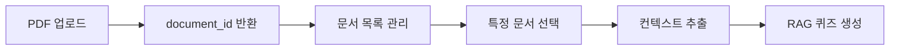

# RAG 통합 가이드 📚

## 🎯 워크플로우 개요

PDF 업로드 → 문서 ID 관리 → RAG 기반 퀴즈 생성 시스템



## 📤 1단계: PDF 업로드

### API 호출
```bash
curl -X POST "http://localhost:8000/pdf/upload" \
     -H "accept: application/json" \
     -H "Content-Type: multipart/form-data" \
     -F "file=@algorithm_study.pdf"
```

### 응답 예시
```json
{
    "message": "PDF 업로드 및 벡터 저장 성공",
    "document_id": "a1b2c3d4-e5f6-7890-abcd-ef1234567890",
    "filename": "algorithm_study.pdf",
    "file_size": 1048576,
    "text_length": 15420,
    "total_chunks": 18,
    "stored_chunks": 18,
    "db_type": "weaviate",
    "upload_timestamp": "2024-01-15T10:30:45.123456",
    "note": "document_id를 저장하여 나중에 RAG 퀴즈 생성 시 사용하세요"
}
```

### 🔑 중요: `document_id` 저장
```python
# 클라이언트에서 document_id 저장
uploaded_documents = {
    "algorithm_study.pdf": "a1b2c3d4-e5f6-7890-abcd-ef1234567890",
    "database_intro.pdf": "b2c3d4e5-f6g7-8901-bcde-f23456789012",
    "web_development.pdf": "c3d4e5f6-g7h8-9012-cdef-345678901234"
}
```

## 📋 2단계: 문서 목록 관리

### 업로드된 문서 목록 조회
```bash
curl -X GET "http://localhost:8000/pdf/documents"
```

### 응답 예시
```json
{
    "message": "문서 목록 조회 성공",
    "total_documents": 3,
    "documents": [
        {
            "document_id": "a1b2c3d4-e5f6-7890-abcd-ef1234567890",
            "source_filename": "algorithm_study.pdf",
            "chunk_count": 18,
            "upload_timestamp": "2024-01-15T10:30:45.123456",
            "total_chars": 15420,
            "available_for_rag": true,
            "recommended_for_quiz": true
        }
    ],
    "note": "document_id를 사용하여 특정 문서로 RAG 퀴즈를 생성할 수 있습니다"
}
```

### UI 예시 (React)
```jsx
function DocumentList({ documents, onSelectDocument }) {
    return (
        <div className="document-list">
            <h3>📚 업로드된 문서</h3>
            {documents.map(doc => (
                <div key={doc.document_id} className="document-card">
                    <h4>{doc.source_filename}</h4>
                    <p>청크: {doc.chunk_count}개</p>
                    <p>업로드: {new Date(doc.upload_timestamp).toLocaleString()}</p>

                    {doc.recommended_for_quiz && (
                        <span className="badge">🎯 퀴즈 생성 권장</span>
                    )}

                    <button
                        onClick={() => onSelectDocument(doc.document_id)}
                        className="btn-generate-quiz"
                    >
                        📝 이 문서로 퀴즈 생성
                    </button>
                </div>
            ))}
        </div>
    );
}
```

## 📄 3단계: 특정 문서 정보 조회

### API 호출
```bash
curl -X GET "http://localhost:8000/pdf/documents/a1b2c3d4-e5f6-7890-abcd-ef1234567890"
```

### 응답 예시 (RAG 정보 포함)
```json
{
    "message": "문서 정보 조회 성공",
    "document": {
        "document_id": "a1b2c3d4-e5f6-7890-abcd-ef1234567890",
        "source_filename": "algorithm_study.pdf",
        "chunk_count": 18,
        "total_chars": 15420,
        "rag_ready": true,
        "chunk_size_avg": 856,
        "quiz_generation_score": 10
    },
    "rag_info": {
        "can_generate_quiz": true,
        "recommended_questions": 9,
        "content_quality": "high"
    }
}
```

## 🎯 4단계: RAG 컨텍스트 추출

### 특정 문서에서 검색
```bash
curl -X GET "http://localhost:8000/pdf/search/a1b2c3d4-e5f6-7890-abcd-ef1234567890?query=동적계획법&top_k=5"
```

### 응답 예시 (RAG 컨텍스트 포함)
```json
{
    "message": "문서 내 검색 완료",
    "document_id": "a1b2c3d4-e5f6-7890-abcd-ef1234567890",
    "document_filename": "algorithm_study.pdf",
    "query": "동적계획법",
    "total_results": 5,
    "results": [
        {
            "doc_id": "a1b2c3d4_chunk_0",
            "text_preview": "동적계획법은 복잡한 문제를 간단한 하위 문제로...",
            "full_text": "동적계획법은 복잡한 문제를 간단한 하위 문제로 나누어 해결하는 알고리즘 기법입니다. 메모이제이션을 활용하여 중복 계산을 방지하고...",
            "similarity": 0.8542,
            "chunk_index": 0
        }
    ],
    "rag_context": {
        "combined_text": "동적계획법은 복잡한 문제를 간단한 하위 문제로 나누어 해결하는 알고리즘 기법입니다...",
        "context_length": 4280,
        "ready_for_rag": true
    }
}
```

## 🤖 5단계: RAG 퀴즈 생성

### Python 클라이언트 예시
```python
import requests
import openai

class RAGQuizGenerator:
    def __init__(self, pdf_api_base="http://localhost:8000", openai_api_key="your-key"):
        self.pdf_api_base = pdf_api_base
        openai.api_key = openai_api_key

    def generate_quiz_from_document(self, document_id: str, topic: str, num_questions: int = 5):
        """특정 문서 ID로 RAG 퀴즈 생성"""

        # 1. 컨텍스트 추출
        context_response = requests.get(
            f"{self.pdf_api_base}/pdf/search/{document_id}",
            params={"query": topic, "top_k": num_questions * 2}
        )

        if context_response.status_code != 200:
            raise Exception(f"컨텍스트 추출 실패: {context_response.text}")

        context_data = context_response.json()
        rag_context = context_data["rag_context"]["combined_text"]

        # 2. OpenAI GPT로 퀴즈 생성
        prompt = f"""
        다음 학습 자료를 바탕으로 {num_questions}개의 퀴즈를 생성해주세요.

        주제: {topic}
        학습 자료:
        {rag_context}

        다음 JSON 형식으로 응답해주세요:
        {{
            "quiz_id": "unique_id",
            "topic": "{topic}",
            "questions": [
                {{
                    "question": "문제 내용",
                    "type": "multiple_choice",
                    "options": ["A", "B", "C", "D"],
                    "correct_answer": "A",
                    "explanation": "정답 설명"
                }}
            ]
        }}
        """

        response = openai.ChatCompletion.create(
            model="gpt-4",
            messages=[
                {"role": "system", "content": "당신은 교육 전문가입니다. 주어진 자료로 정확한 퀴즈를 생성하세요."},
                {"role": "user", "content": prompt}
            ],
            temperature=0.7
        )

        return {
            "source_document_id": document_id,
            "context_length": len(rag_context),
            "generated_quiz": response.choices[0].message.content
        }

# 사용 예시
quiz_generator = RAGQuizGenerator()

# 특정 문서로 퀴즈 생성
quiz_result = quiz_generator.generate_quiz_from_document(
    document_id="a1b2c3d4-e5f6-7890-abcd-ef1234567890",
    topic="동적계획법",
    num_questions=5
)

print(f"생성된 퀴즈: {quiz_result['generated_quiz']}")
```

## 🔄 완전한 워크플로우 예시

### FastAPI + React 통합 예시

#### Backend (FastAPI)
```python
from fastapi import FastAPI
import requests
import openai

app = FastAPI()

@app.post("/generate-quiz/")
async def generate_quiz(
    document_id: str,
    topic: str,
    num_questions: int = 5
):
    """문서 ID 기반 RAG 퀴즈 생성"""

    # 1. 벡터 DB에서 컨텍스트 추출
    vector_response = requests.get(
        f"http://localhost:8000/pdf/search/{document_id}",
        params={"query": topic, "top_k": num_questions * 2}
    )

    context_data = vector_response.json()
    rag_context = context_data["rag_context"]["combined_text"]

    # 2. GPT로 퀴즈 생성
    quiz = await generate_quiz_with_gpt(rag_context, topic, num_questions)

    return {
        "document_id": document_id,
        "topic": topic,
        "quiz": quiz,
        "context_source": context_data["document_filename"]
    }
```

#### Frontend (React)
```jsx
function QuizGenerator() {
    const [documents, setDocuments] = useState([]);
    const [selectedDoc, setSelectedDoc] = useState(null);
    const [quiz, setQuiz] = useState(null);

    // 1. 문서 목록 로드
    useEffect(() => {
        fetch('/pdf/documents')
            .then(res => res.json())
            .then(data => setDocuments(data.documents));
    }, []);

    // 2. 퀴즈 생성
    const generateQuiz = async (documentId, topic) => {
        const response = await fetch('/generate-quiz/', {
            method: 'POST',
            headers: { 'Content-Type': 'application/json' },
            body: JSON.stringify({
                document_id: documentId,
                topic: topic,
                num_questions: 5
            })
        });

        const quizData = await response.json();
        setQuiz(quizData);
    };

    return (
        <div className="quiz-generator">
            <h2>📝 RAG 퀴즈 생성기</h2>

            {/* 문서 선택 */}
            <DocumentSelector
                documents={documents}
                onSelect={setSelectedDoc}
            />

            {/* 퀴즈 생성 */}
            {selectedDoc && (
                <QuizForm
                    document={selectedDoc}
                    onGenerate={generateQuiz}
                />
            )}

            {/* 생성된 퀴즈 */}
            {quiz && (
                <QuizDisplay quiz={quiz} />
            )}
        </div>
    );
}
```

## 📊 사용 시나리오

### 시나리오 1: 학습자 개별 퀴즈
1. 학습자가 PDF 강의자료 업로드
2. `document_id` 저장
3. 학습 후 해당 자료로 복습 퀴즈 생성
4. 반복 학습 가능

### 시나리오 2: 강사 수업 운영
1. 강사가 여러 PDF 자료 업로드
2. 문서 목록에서 수업별 자료 선택
3. 수업 주제에 맞는 퀴즈 즉석 생성
4. 학생들에게 실시간 퀴즈 제공

### 시나리오 3: 기업 교육
1. 기업 교육 자료들 일괄 업로드
2. 부서별/직급별 맞춤 문서 선택
3. 직무 역량별 퀴즈 생성
4. 개인별 학습 진도 관리

## ⚡ 성능 최적화

### 1. 캐싱 전략
```python
from functools import lru_cache

@lru_cache(maxsize=100)
def get_document_context(document_id: str, topic: str):
    """문서 컨텍스트 캐싱"""
    # 자주 사용되는 컨텍스트는 캐시에서 바로 반환
    pass
```

### 2. 비동기 처리
```python
import asyncio

async def generate_multiple_quizzes(document_ids: List[str], topics: List[str]):
    """여러 문서 동시 퀴즈 생성"""
    tasks = [
        generate_quiz_from_document(doc_id, topic)
        for doc_id, topic in zip(document_ids, topics)
    ]
    return await asyncio.gather(*tasks)
```

### 3. 배치 처리
```python
def batch_upload_pdfs(pdf_files: List[str]) -> Dict[str, str]:
    """PDF 파일들 일괄 업로드"""
    document_mapping = {}

    for pdf_file in pdf_files:
        result = upload_pdf(pdf_file)
        document_mapping[pdf_file] = result["document_id"]

    return document_mapping
```

## 🔍 문제 해결

### Q: 컨텍스트가 너무 길어서 GPT 토큰 제한 초과
```python
def truncate_context(context: str, max_tokens: int = 3000) -> str:
    """컨텍스트 길이 제한"""
    # 대략 4자 = 1토큰으로 계산
    max_chars = max_tokens * 4

    if len(context) <= max_chars:
        return context

    # 문장 단위로 자르기
    sentences = context.split('. ')
    truncated = ""

    for sentence in sentences:
        if len(truncated + sentence) < max_chars:
            truncated += sentence + ". "
        else:
            break

    return truncated.strip()
```

### Q: 검색 결과가 부정확함
```python
# 검색 쿼리 개선
def improve_search_query(original_query: str) -> str:
    """검색 쿼리 확장"""
    synonyms = {
        "동적계획법": "동적계획법 DP dynamic programming 메모이제이션",
        "알고리즘": "알고리즘 algorithm 자료구조 효율성",
        "데이터베이스": "데이터베이스 DB database 테이블 쿼리"
    }

    return synonyms.get(original_query, original_query)
```

## 📈 모니터링 및 분석

### 사용량 추적
```python
class QuizAnalytics:
    def __init__(self):
        self.usage_stats = {}

    def track_quiz_generation(self, document_id: str, topic: str, user_id: str):
        """퀴즈 생성 추적"""
        key = f"{document_id}:{topic}"
        if key not in self.usage_stats:
            self.usage_stats[key] = {
                "count": 0,
                "users": set(),
                "last_used": None
            }

        self.usage_stats[key]["count"] += 1
        self.usage_stats[key]["users"].add(user_id)
        self.usage_stats[key]["last_used"] = datetime.now()

    def get_popular_documents(self) -> List[Dict]:
        """인기 문서 분석"""
        return sorted(
            self.usage_stats.items(),
            key=lambda x: x[1]["count"],
            reverse=True
        )[:10]
```

---

## 🎉 결론

이제 PDF 업로드부터 RAG 기반 퀴즈 생성까지의 완전한 워크플로우가 구축되었습니다!

### ✅ 핵심 장점
- **문서 ID 기반 관리**: 정확한 문서 타겟팅
- **유연한 RAG 통합**: 다양한 AI 모델 연동 가능
- **확장 가능한 아키텍처**: 새로운 기능 추가 용이
- **성능 최적화**: 캐싱 및 비동기 처리 지원

### 🚀 다음 단계
1. GPT-4/Claude 등 LLM 연동
2. 퀴즈 품질 평가 시스템
3. 학습자 피드백 수집
4. 개인화 추천 엔진